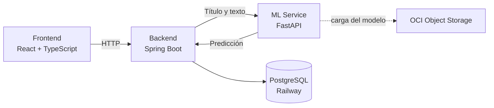
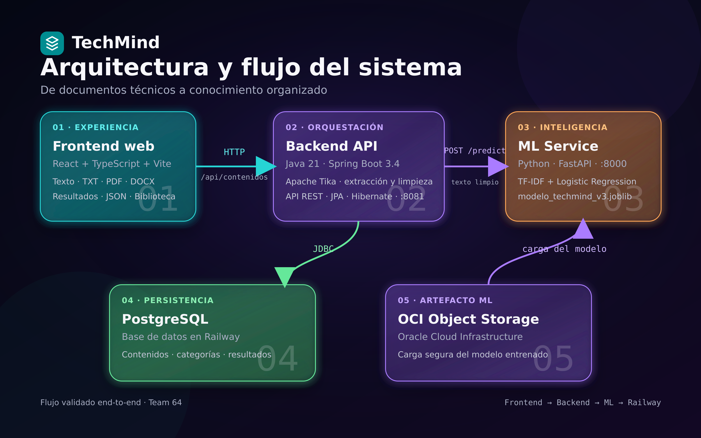

<div align="center">

<h1> TechMind</h1>

<h3>Organización inteligente del conocimiento técnico</h3>

<p>Transforma textos y documentos técnicos en información clasificada, resumida y fácil de consultar.</p>


**Hackathon ONE · No Country · G9 LATAM · Team 64**

</div>

---

## Contenido

- [El problema](#el-problema)
- [Nuestra solución](#nuestra-solución)
- [Propuesta de valor](#propuesta-de-valor)
- [Funcionalidades](#funcionalidades)
- [Cómo funciona](#cómo-funciona)
- [Arquitectura](#arquitectura)
- [Machine Learning](#machine-learning)
- [Tecnologías](#tecnologías)
- [Estructura del repositorio](#estructura-del-repositorio)
- [Instalación y ejecución](#instalación-y-ejecución)
- [Variables de entorno](#variables-de-entorno)
- [API](#api)
- [Pruebas](#pruebas)
- [Estado del MVP](#estado-del-mvp)
- [Equipo](#equipo)

---

## El problema

Cada día estudiantes y profesionales consultan documentación, cursos, artículos y apuntes técnicos. Sin embargo, esa información suele quedar dispersa entre diferentes archivos y plataformas, lo que dificulta encontrarla nuevamente, relacionarla y decidir qué contenido revisar después.

## Nuestra solución

TechMind convierte contenido técnico sin estructurar en conocimiento organizado.

El usuario puede escribir un texto o adjuntar un documento. La plataforma extrae y prepara su contenido, identifica la categoría temática mediante Machine Learning y devuelve información útil para su consulta y reutilización.

## Propuesta de valor

TechMind reduce el trabajo manual necesario para organizar información técnica y permite obtener en una sola operación:

- La categoría temática del contenido.
- La probabilidad y el nivel de confianza de la predicción.
- Las palabras clave más representativas.
- Temas relacionados.
- Un resumen corto.
- Un registro persistente para consultas posteriores.

De esta manera, los documentos dejan de ser archivos aislados y se convierten en información estructurada y fácil de explorar.

---

## Funcionalidades

- Análisis de texto escrito directamente en la interfaz.
- Carga y extracción de documentos `TXT`, `PDF` y `DOCX`.
- Clasificación automática en cinco áreas técnicas.
- Extracción de palabras clave mediante TF-IDF.
- Generación de temas relacionados y resumen corto.
- Representación numérica y textual de la confianza.
- Persistencia de resultados en PostgreSQL.
- Biblioteca para consultar contenidos procesados.
- Interfaz disponible en español e inglés.

### Categorías del modelo

- Backend
- Frontend
- Data Science
- Cloud/DevOps
- Bases de Datos

---

## Cómo funciona

1. El usuario escribe contenido técnico o adjunta un documento.
2. El frontend envía la solicitud al backend.
3. Si se adjunta un archivo, el backend extrae y limpia el texto.
4. El backend envía el título y el texto preparado al servicio de Machine Learning.
5. El modelo genera la categoría, probabilidad y palabras clave.
6. El backend complementa la respuesta y guarda el resultado en PostgreSQL.
7. El frontend presenta el análisis en formato visual y JSON.

---

## Arquitectura





### Responsabilidad de cada componente

| Componente | Responsabilidad |
|---|---|
| Frontend | Captura el texto o documento y presenta los resultados. |
| Backend | Centraliza la extracción, preparación, integración y persistencia. |
| ML Service | Clasifica el contenido y obtiene la probabilidad y palabras clave. |
| PostgreSQL | Conserva el historial de contenidos procesados. |
| OCI Object Storage | Almacena el artefacto entrenado del modelo. |

---

## Machine Learning

El clasificador fue desarrollado con un pipeline de procesamiento de lenguaje natural:

```text
Texto técnico → TF-IDF → Logistic Regression → Categoría y probabilidad
```

### Datos y entrenamiento

- Dataset consolidado con 98 registros válidos.
- Cinco categorías técnicas.
- Limpieza y exploración inicial del texto.
- Vectorización mediante TF-IDF.
- Clasificación mediante Logistic Regression.
- Balance de clases durante el entrenamiento.
- Validación cruzada y evaluación sobre un conjunto de prueba.
- Artefacto estable: `modelo_techmind_v3.joblib`.

La evaluación registrada alcanzó aproximadamente **95 % de accuracy** sobre el conjunto de prueba. Debido al tamaño actual del dataset, esta métrica debe interpretarse como un resultado inicial del MVP y no como una garantía de desempeño sobre cualquier contenido.

### Salida del modelo

```json
{
  "categoria": "Data Science",
  "probabilidad": 0.47,
  "confianza": "alta",
  "palabras_clave": [
    "regresión logística",
    "vectores numéricos",
    "precision recall"
  ],
  "temas_relacionados": [
    "Machine Learning",
    "Análisis de datos",
    "Modelos predictivos"
  ],
  "resumen_corto": "Introducción a la clasificación de texto...",
  "requiere_revision": false
}
```

`probabilidad` conserva el valor numérico entre `0` y `1`, mientras que `confianza` ofrece una interpretación textual: `alta`, `media` o `baja`.

---

## Tecnologías

| Capa | Tecnologías |
|---|---|
| Frontend | React, TypeScript, Vite y CSS |
| Backend | Java 21, Spring Boot 3.4, Maven, Spring Data JPA y Hibernate |
| Machine Learning | Python, FastAPI, Uvicorn, scikit-learn, TF-IDF, Logistic Regression y joblib |
| Base de datos | PostgreSQL en Railway |
| Nube | Oracle Cloud Infrastructure Object Storage |
| Contenedores | Docker |
| Control de versiones | Git y GitHub |

---

## Estructura del repositorio

```text
G9-LATAM-TEAM-64-TECHMIND/
├── backend/                 # API principal en Spring Boot
│   ├── src/main/java/       # Controladores, servicios, DTO y entidades
│   ├── src/main/resources/  # Configuración de la aplicación
│   ├── src/test/            # Pruebas del backend
│   └── pom.xml              # Dependencias Maven
├── frontend/                # Aplicación web en React y TypeScript
│   ├── src/components/      # Componentes compartidos
│   ├── src/features/        # Analizador, biblioteca y contenido
│   └── package.json         # Dependencias y scripts
├── ml-service/              # API de inferencia en FastAPI
│   ├── main.py              # Contrato, inferencia y posprocesamiento
│   ├── models/              # Artefactos del modelo
│   └── requirements.txt     # Dependencias de Python
└── README.md                # Documentación principal
```

---

## Instalación y ejecución

### Requisitos previos

- Git
- Java 21
- Node.js y npm
- Python 3.12 o compatible
- Acceso a una base de datos PostgreSQL

### 1. Clonar el repositorio

```bash
git clone https://github.com/No-Country-simulation/G9-LATAM-TEAM-64-TECHMIND.git
cd G9-LATAM-TEAM-64-TECHMIND
```

### 2. Ejecutar el ML Service

Desde Git Bash en Windows:

```bash
cd ml-service
python -m venv .venv
source .venv/Scripts/activate
pip install -r requirements.txt
uvicorn main:app --reload --port 8000
```

El servicio quedará disponible en:

- API: `http://127.0.0.1:8000`
- Swagger: `http://127.0.0.1:8000/docs`

### 3. Ejecutar el backend

En otra terminal:

```bash
cd backend
./mvnw.cmd spring-boot:run
```

El backend utiliza el puerto:

```text
http://localhost:8081
```

### 4. Ejecutar el frontend

En una tercera terminal:

```bash
cd frontend
npm install
npm run dev -- --port 3000
```

Abrir en el navegador:

```text
http://localhost:3000
```

> El puerto `3000` mantiene compatibilidad con la configuración CORS actual del backend. Si el equipo unifica CORS con el puerto predeterminado de Vite, podrá utilizarse `5173`.

---

## Variables de entorno

No subas credenciales reales al repositorio. Utiliza variables de entorno o archivos locales excluidos mediante `.gitignore`.

### Backend

```env
DB_USERNAME=tu_usuario
DB_PASSWORD=tu_contraseña
ML_SERVICE_URL=http://127.0.0.1:8000
```

La URL JDBC debe configurarse en `backend/src/main/resources/application.properties` o mediante la variable definida por el proyecto:

```properties
spring.datasource.url=jdbc:postgresql://HOST:PUERTO/BASE_DE_DATOS
spring.datasource.username=${DB_USERNAME}
spring.datasource.password=${DB_PASSWORD}
server.port=8081
```

### Frontend

Crear `frontend/.env.local`:

```env
VITE_API_URL=http://localhost:8081
```

> Reinicia Vite después de modificar las variables de entorno.

---

## API

### Procesar texto

```http
POST /api/contenidos/procesar
Content-Type: application/json
```

```json
{
  "titulo": "Interfaces con React",
  "texto": "React permite construir interfaces web mediante componentes reutilizables..."
}
```

### Procesar archivo

```http
POST /api/contenidos/procesar-archivo
Content-Type: multipart/form-data
```

Campo del formulario:

```text
file: documento.txt | documento.pdf | documento.docx
```

### Consultar contenidos

```http
GET /api/contenidos
```

### Ejemplo de respuesta persistida

```json
{
  "id": 3,
  "titulo": "prueba data science",
  "texto": "TF-IDF transforma documentos de texto en vectores numéricos...",
  "categoria": "Data Science",
  "etiquetas": ["precision recall", "vectores numericos", "regresion"],
  "confianza": "media",
  "probabilidad": 0.35,
  "palabrasClave": ["precision recall", "vectores numericos", "regresion"],
  "temasRelacionados": ["Machine Learning", "Análisis de datos", "Modelos predictivos"],
  "resumenCorto": "prueba data science. TF-IDF transforma documentos...",
  "requiereRevision": false,
  "fechaRegistro": "2026-08-19T03:09:30"
}
```

---

## Pruebas

### Backend

```bash
cd backend
./mvnw.cmd test
```

Resultado validado:

```text
Tests run: 2, Failures: 0, Errors: 0, Skipped: 0
BUILD SUCCESS
```

### Frontend

```bash
cd frontend
npm run build
```

El build de producción fue completado correctamente.

### Pruebas end-to-end realizadas

| Entrada | Resultado | Persistencia |
|---|---|---|
| Texto pegado | Frontend | Registro creado |
| TXT | Data Science | `id: 3` |
| PDF | Cloud/DevOps | `id: 4` |
| DOCX | Bases de Datos | `id: 5` |

Las pruebas validaron el flujo completo:

```text
Frontend → Backend → extracción → modelo v3 → PostgreSQL en Railway
```

En todos los casos se generaron categoría, palabras clave, temas relacionados y resumen.

---

## Estado del MVP

### Implementado y validado

- Flujo de clasificación de texto.
- Extracción de TXT, PDF y DOCX.
- Clasificación en cinco categorías.
- Palabras clave, temas relacionados y resumen.
- Persistencia en PostgreSQL.
- Integración Backend → ML Service.
- Interfaz bilingüe ES/EN.
- Contrato de probabilidad numérica y confianza textual.
- Mejora inicial del filtrado de palabras genéricas.

### Mejoras identificadas

- Unificar el contrato de la biblioteca entre backend y frontend.
- Restringir desde la interfaz los formatos no compatibles.
- Devolver `400` o `415` para archivos no admitidos en lugar de `500`.
- Mantener el título escrito por el usuario al procesar un archivo.
- Unificar puertos, CORS y variables de entorno.
- Actualizar en la interfaz la ruta real del endpoint.
- Continuar ampliando y validando el dataset.
- Mejorar el filtrado y ranking de palabras clave.
- Incorporar pruebas automatizadas para los contratos entre servicios.

---

## Equipo

Proyecto desarrollado por **G9 LATAM · Team 64** durante el Hackathon ONE de No Country.

## Integrantes del equipo

| Integrante | Rol | Contribución |
|---|---|---|
| Nahir Icare | Full Stack Developer | Integración final de la aplicación, conexión con PostgreSQL en Neon y procesamiento de contenido mediante texto y archivos PDF. |
| Mauricio Martínez | Back-End Developer | Desarrollo y corrección de la API, persistencia de contenidos e integración del backend con el servicio de Machine Learning. |
| Félix Robert Aguilar Barrera | Back-End Developer | Creación del controlador de contenidos y definición inicial de los endpoints REST para procesar y consultar contenidos. |
| Verónica Apolaya | Data Analyst / Machine Learning | Preparación del dataset, EDA, entrenamiento y evaluación del modelo, integración ML, pruebas end-to-end y documentación. |

> Antes de publicar la versión final, completar los nombres y aportes de todos los integrantes.

---

## Recursos

- [Repositorio del proyecto](https://github.com/No-Country-simulation/G9-LATAM-TEAM-64-TECHMIND)
- Demo desplegada: `pendiente de agregar`
- Video de presentación: `pendiente de agregar`

---

## Licencia

Este proyecto fue desarrollado con fines educativos en el contexto del Hackathon ONE de No Country.

---

<div align="center">

**TechMind · De contenido técnico a conocimiento organizado**

</div>
